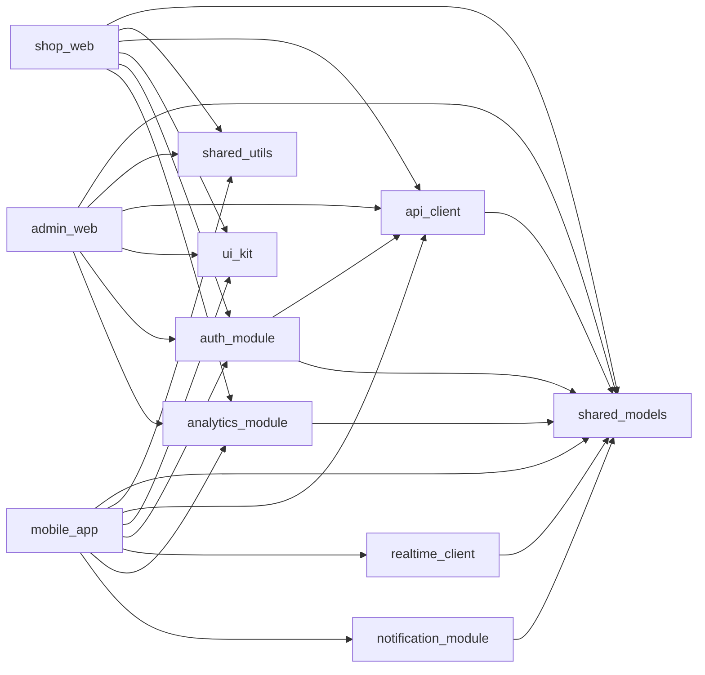

# Architecture

This document describes the technical architecture of the AlakhService platform.

---

## Table of Contents

- [High-Level System Design](#high-level-system-design)
- [App Architecture](#app-architecture)
- [State Management](#state-management)
- [Navigation Architecture](#navigation-architecture)
- [Data Flow](#data-flow)
- [Package Dependency Graph](#package-dependency-graph)
- [API Client Architecture](#api-client-architecture)
- [Real-Time Communication](#real-time-communication)
- [Authentication Flow](#authentication-flow)
- [Error Handling Strategy](#error-handling-strategy)
- [Testing Strategy](#testing-strategy)

---

## High-Level System Design

```
┌─────────────────────────────────────────────────────────────┐
│                      Client Layer                           │
│   ┌──────────────┐  ┌──────────────┐  ┌──────────────────┐ │
│   │  mobile_app  │  │  shop_web    │  │   admin_web      │ │
│   │ Android/iOS  │  │ Flutter Web  │  │  Flutter Web     │ │
│   └──────┬───────┘  └──────┬───────┘  └────────┬─────────┘ │
└──────────┼────────────────┼─────────────────────┼───────────┘
           │                │                     │
           └────────────────┼─────────────────────┘
                            │ HTTPS / WebSocket
┌───────────────────────────▼─────────────────────────────────┐
│                      Backend Layer                           │
│   ┌──────────────────────────────────────────────────────┐  │
│   │              REST API (Node.js / Go)                 │  │
│   └──────────────────────────────────────────────────────┘  │
│   ┌──────────────────────────────────────────────────────┐  │
│   │              WebSocket Server                        │  │
│   └──────────────────────────────────────────────────────┘  │
│   ┌──────────────────────────────────────────────────────┐  │
│   │              Firebase Cloud Messaging                │  │
│   └──────────────────────────────────────────────────────┘  │
└─────────────────────────────────────────────────────────────┘
           │
┌──────────▼──────────────────────────────────────────────────┐
│                      Data Layer                              │
│   ┌────────────┐  ┌──────────┐  ┌──────────┐  ┌──────────┐ │
│   │ PostgreSQL │  │  Redis   │  │   S3     │  │ Firebase │ │
│   └────────────┘  └──────────┘  └──────────┘  └──────────┘ │
└─────────────────────────────────────────────────────────────┘
```

---

## App Architecture

All three apps follow **Clean Architecture** with three layers:

```
┌─────────────────────────────────────────────────────────────┐
│  Presentation Layer                                          │
│  ├── Pages (UI screens)                                      │
│  ├── Widgets (reusable UI components)                        │
│  └── BLoCs / Cubits (state management)                      │
├─────────────────────────────────────────────────────────────┤
│  Domain Layer                                                │
│  ├── Entities (pure Dart business objects)                   │
│  ├── Repository Interfaces (abstract contracts)              │
│  └── Use Cases (single-responsibility business logic)        │
├─────────────────────────────────────────────────────────────┤
│  Data Layer                                                  │
│  ├── Repository Implementations                              │
│  ├── Data Sources (remote API, local storage)               │
│  └── Data Transfer Objects (DTOs with JSON serialization)   │
└─────────────────────────────────────────────────────────────┘
```

### Feature Module Structure

Each feature follows this folder structure:

```
features/
  booking/
    data/
      datasources/
        booking_remote_datasource.dart
        booking_local_datasource.dart
      models/
        booking_dto.dart               # JSON serializable
        booking_dto.g.dart             # generated
      repositories/
        booking_repository_impl.dart
    domain/
      entities/
        booking.dart                   # Freezed / pure Dart
        booking.freezed.dart           # generated
      repositories/
        booking_repository.dart        # abstract interface
      usecases/
        create_booking_use_case.dart
        get_bookings_use_case.dart
        cancel_booking_use_case.dart
    presentation/
      bloc/
        booking_bloc.dart
        booking_event.dart
        booking_state.dart
      pages/
        booking_page.dart
        booking_confirmation_page.dart
      widgets/
        booking_card.dart
        booking_slot_picker.dart
```

---

## State Management

AlakhService uses **BLoC** (Business Logic Component) via `flutter_bloc`.

### BLoC vs Cubit

| Use Case | Use |
|----------|-----|
| Complex event-driven logic, async operations | BLoC |
| Simple state transitions, UI-only state | Cubit |

### Pattern

```dart
// 1. Events (triggers)
abstract class BookingEvent {}
class CreateBookingEvent extends BookingEvent {
  final BookingRequest request;
  const CreateBookingEvent(this.request);
}

// 2. States (UI snapshots)
abstract class BookingState {}
class BookingInitial extends BookingState {}
class BookingLoading extends BookingState {}
class BookingSuccess extends BookingState {
  final Booking booking;
  const BookingSuccess(this.booking);
}
class BookingFailure extends BookingState {
  final String message;
  const BookingFailure(this.message);
}

// 3. BLoC (transforms events → states)
@injectable
class BookingBloc extends Bloc<BookingEvent, BookingState> {
  final CreateBookingUseCase _createBooking;

  BookingBloc(this._createBooking) : super(BookingInitial()) {
    on<CreateBookingEvent>(_onCreate);
  }

  Future<void> _onCreate(
    CreateBookingEvent event,
    Emitter<BookingState> emit,
  ) async {
    emit(BookingLoading());
    final result = await _createBooking(event.request);
    result.fold(
      (failure) => emit(BookingFailure(failure.message)),
      (booking) => emit(BookingSuccess(booking)),
    );
  }
}
```

### Dependency Injection with BLoC

BLoCs are provided via `BlocProvider` at the feature route level:

```dart
GoRoute(
  path: '/booking',
  builder: (context, state) => BlocProvider(
    create: (context) => getIt<BookingBloc>(),
    child: const BookingPage(),
  ),
),
```

---

## Navigation Architecture

GoRouter is used for declarative routing. Features register their own routes.

```dart
// core/routing/app_router.dart
final GoRouter appRouter = GoRouter(
  initialLocation: '/',
  routes: [
    ...authRoutes,
    ...discoveryRoutes,
    ...bookingRoutes,
    // ...
  ],
);
```

### Deep Linking

GoRouter handles deep links natively. Supported deep link patterns:

```
alakhservice://booking/:id        # Open specific booking
alakhservice://shop/:id           # Open shop profile
alakhservice://payment/success    # Payment confirmation
```

---

## Data Flow

```
User Action
    │
    ▼
Widget dispatches Event
    │
    ▼
BLoC receives Event
    │
    ▼
Use Case is called (domain)
    │
    ▼
Repository Interface (domain)
    │
    ▼
Repository Implementation (data)
    │
    ├──► Remote Data Source ──► REST API
    │
    └──► Local Data Source ──► Hive / SharedPreferences
    │
    ▼
Either<Failure, Entity>
    │
    ▼
BLoC emits new State
    │
    ▼
Widget rebuilds via BlocBuilder
```

---

## Package Dependency Graph



---

## API Client Architecture

The `api_client` package wraps Dio with:

```
api_client/
  lib/
    src/
      interceptors/
        auth_interceptor.dart       # Adds Bearer token to requests
        refresh_token_interceptor.dart  # Auto-refreshes expired tokens
        logging_interceptor.dart    # Request/response logging
        retry_interceptor.dart      # Retry on network failure
      api_client.dart               # Core Dio wrapper
      api_exception.dart            # Typed exceptions
      api_result.dart               # Either<ApiException, T>
```

### Error Mapping

| HTTP Status | Exception Type |
|------------|---------------|
| 400 | `BadRequestException` |
| 401 | `UnauthorizedException` |
| 403 | `ForbiddenException` |
| 404 | `NotFoundException` |
| 422 | `ValidationException` |
| 429 | `RateLimitException` |
| 500+ | `ServerException` |
| Network error | `NetworkException` |

---

## Real-Time Communication

The `realtime_client` package manages WebSocket connections for:

- Live queue updates
- Real-time booking status changes
- Staff dispatch notifications
- In-app chat messages
- Fraud alerts (admin)

```dart
@injectable
class RealtimeClient {
  final WebSocketChannel _channel;

  Stream<QueueUpdateEvent> get queueUpdates => _channel.stream
      .where((msg) => msg['type'] == 'queue_update')
      .map(QueueUpdateEvent.fromJson);

  Future<void> connect(String token) async { /* ... */ }
  Future<void> disconnect() async { /* ... */ }
}
```

---

## Authentication Flow

```
App Start
    │
    ▼
Check stored token ──── No token ──► Login Screen
    │                                     │
    │ Token found                         │ OTP Verified
    ▼                                     ▼
Validate token              Firebase Phone Auth
    │                             │
    │ Valid                       │ ID Token
    ▼                             ▼
App Shell                 POST /api/auth/verify
                               │
                               │ JWT access + refresh tokens
                               ▼
                          Store tokens securely
                          (flutter_secure_storage)
                               │
                               ▼
                          App Shell
```

### Token Refresh

The `auth_interceptor` in `api_client` automatically refreshes expired access tokens using the refresh token. If the refresh token is also expired, the user is signed out and redirected to the login screen.

---

## Error Handling Strategy

### Domain Layer

Use `Either<Failure, T>` from `fpdart`:

```dart
abstract class Failure {
  final String message;
  const Failure(this.message);
}

class NetworkFailure extends Failure {
  const NetworkFailure() : super('No internet connection');
}

class ServerFailure extends Failure {
  const ServerFailure(super.message);
}

// Repository returns Either
Future<Either<Failure, Booking>> createBooking(BookingRequest request);
```

### Presentation Layer

BLoCs convert `Failure` to user-friendly error states:

```dart
result.fold(
  (failure) => emit(BookingError(failure.message)),
  (booking) => emit(BookingSuccess(booking)),
);
```

### Global Error Handling

Uncaught errors in the Flutter framework are caught via `FlutterError.onError` and logged to the analytics module.

---

## Testing Strategy

### Unit Tests

- All Use Cases must have 90%+ coverage.
- Repository implementations tested with mocked data sources.
- BLoCs tested with `bloc_test` using `blocTest<>()`.

```dart
blocTest<BookingBloc, BookingState>(
  'emits [Loading, Success] when booking is created',
  build: () => BookingBloc(mockUseCase),
  act: (bloc) => bloc.add(CreateBookingEvent(request)),
  expect: () => [BookingLoading(), BookingSuccess(booking)],
);
```

### Widget Tests

- All pages have a widget test verifying the happy path.
- Widget tests use `MockBloc` to control state.

### Integration Tests

- Critical user flows have end-to-end integration tests:
  - Auth → Discovery → Booking → Payment
  - Shop login → Queue management → Dispatch

### Test Coverage Targets

| Layer | Target |
|-------|--------|
| Domain (Use Cases) | 90% |
| Data (Repositories) | 80% |
| Presentation (BLoCs) | 85% |
| Presentation (Widgets) | 70% |
| Overall | 70%+ |
