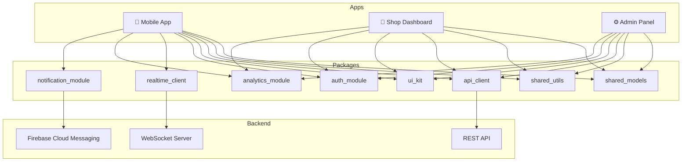

# AlakhService

<!-- PROJECT LOGO -->
<p align="center">
  
</p>

<h3 align="center">AlakhService — Hyperlocal Service Marketplace</h3>

<p align="center">
  A full-stack Flutter monorepo powering a hyperlocal service marketplace with a consumer mobile app, shop owner dashboard, and admin control panel.
  <br />
  <a href="docs/setup.md"><strong>Setup Guide »</strong></a>
  ·
  <a href="ARCHITECTURE.md"><strong>Architecture »</strong></a>
  ·
  <a href="CONTRIBUTING.md"><strong>Contributing »</strong></a>
</p>

<!-- BADGES -->
<p align="center">
  <a href="https://github.com/alakh8653/alakh_service/actions/workflows/ci.yml">
    
  </a>
  <a href="https://codecov.io/gh/alakh8653/alakh_service">
    
  </a>
  
  
  
  
</p>

---

## Overview

**AlakhService** is a hyperlocal service marketplace platform that connects consumers with nearby service providers (shops/vendors). The platform supports real-time booking, live queue management, in-app payments, and trust scoring.

### Platform Components

| App | Platform | Description |
|-----|----------|-------------|
| `mobile_app` | Android & iOS | Consumer-facing app for discovering shops, booking services, tracking, and payments |
| `shop_web` | Flutter Web | Shop owner dashboard for managing bookings, staff, queue, earnings, and analytics |
| `admin_web` | Flutter Web | Admin control panel for city management, shop approvals, fraud monitoring, and platform analytics |

### Shared Packages

| Package | Description |
|---------|-------------|
| `shared_models` | Shared data models, DTOs, and entity classes |
| `shared_utils` | Common utilities, extensions, helpers |
| `api_client` | HTTP client, interceptors, error handling |
| `ui_kit` | Shared UI components, themes, and design system |
| `auth_module` | Authentication logic, token management |
| `realtime_client` | WebSocket / real-time event client |
| `analytics_module` | Analytics tracking and event logging |
| `notification_module` | Push notification handling |

---

## Architecture Diagram



---

## Tech Stack

| Layer | Technology |
|-------|------------|
| Framework | Flutter 3.22.2 / Dart 3.4.3 |
| State Management | BLoC / Cubit (flutter_bloc) |
| Navigation | GoRouter |
| Dependency Injection | get_it + injectable |
| HTTP Client | Dio |
| Real-time | WebSocket (web_socket_channel) |
| Local Storage | Hive + flutter_secure_storage |
| Code Generation | build_runner, freezed, json_serializable, injectable_generator |
| Localisation | Flutter Gen L10n (ARB) |
| Monorepo | Melos |
| CI/CD | GitHub Actions |
| Testing | flutter_test, bloc_test, mocktail |
| Coverage | lcov / Codecov |

---

## Project Structure

```
alakh_service/
├── apps/
│   ├── mobile_app/           # Consumer Flutter App (Android & iOS)
│   │   ├── lib/
│   │   │   ├── core/         # DI, routing, theme, network, errors
│   │   │   ├── shared/       # Shared widgets, layout, utilities
│   │   │   └── features/     # 17 feature modules
│   │   ├── test/
│   │   ├── android/
│   │   ├── ios/
│   │   └── pubspec.yaml
│   ├── shop_web/             # Shop Owner Flutter Web App
│   │   ├── lib/
│   │   │   ├── core/
│   │   │   ├── shared/
│   │   │   └── features/     # 9 feature modules
│   │   ├── web/
│   │   └── pubspec.yaml
│   └── admin_web/            # Admin Control Panel Flutter Web App
│       ├── lib/
│       │   ├── core/
│       │   ├── shared/
│       │   └── features/     # 9 feature modules
│       ├── web/
│       └── pubspec.yaml
├── packages/
│   ├── shared_models/        # Data models & entities
│   ├── shared_utils/         # Utilities & extensions
│   ├── api_client/           # HTTP client & interceptors
│   ├── ui_kit/               # Design system & shared widgets
│   ├── auth_module/          # Authentication
│   ├── realtime_client/      # WebSocket client
│   ├── analytics_module/     # Analytics & tracking
│   └── notification_module/  # Push notifications
├── docs/                     # Extended documentation
├── .github/
│   ├── workflows/            # GitHub Actions CI/CD
│   ├── ISSUE_TEMPLATE/       # Issue templates
│   ├── PULL_REQUEST_TEMPLATE.md
│   ├── CODEOWNERS
│   └── dependabot.yml
├── melos.yaml                # Melos workspace config
├── pubspec.yaml              # Root workspace pubspec
├── Makefile                  # Developer shortcuts
├── .fvmrc                    # Flutter version pinning
├── .editorconfig             # Editor formatting rules
├── .gitignore
├── README.md
├── ARCHITECTURE.md
├── CONTRIBUTING.md
├── CHANGELOG.md
└── LICENSE
```

---

## Getting Started

### Prerequisites

| Tool | Version | Installation |
|------|---------|-------------|
| Flutter | 3.22.2 | [flutter.dev](https://flutter.dev/docs/get-started/install) |
| Dart | 3.4.3 (bundled with Flutter) | Included with Flutter |
| FVM | latest | `dart pub global activate fvm` |
| Melos | 6.x | `dart pub global activate melos` |
| Xcode | 15+ | Mac App Store (iOS builds only) |
| Android Studio | latest | [developer.android.com](https://developer.android.com/studio) |

### Setup

```bash
# 1. Clone the repository
git clone https://github.com/alakh8653/alakh_service.git
cd alakh_service

# 2. Install the pinned Flutter version with FVM (optional but recommended)
fvm install
fvm use

# 3. Install Melos globally
dart pub global activate melos

# 4. Bootstrap the workspace (installs all dependencies)
melos bootstrap

# 5. Run code generation (Freezed, JsonSerializable, Injectable, etc.)
melos run build:runner

# 6. Generate localizations
melos run gen:l10n
```

Or use the Makefile shortcut:

```bash
make setup         # Installs Melos and bootstraps the workspace
make build-runner  # Runs code generation
make gen-l10n      # Generates l10n
```

### Running Apps

#### Mobile App (Android/iOS)

```bash
cd apps/mobile_app

# Run on Android emulator / device
flutter run --flavor dev --dart-define=FLAVOR=dev

# Run on iOS simulator
flutter run --flavor dev --dart-define=FLAVOR=dev -d "iPhone 15"
```

#### Shop Web Dashboard

```bash
cd apps/shop_web

# Run on Chrome
flutter run -d chrome --dart-define=FLAVOR=dev
```

#### Admin Web Panel

```bash
cd apps/admin_web

# Run on Chrome
flutter run -d chrome --dart-define=FLAVOR=dev
```

### Environment Configuration

The apps use `--dart-define` for environment-specific configuration:

| Variable | Values | Description |
|----------|--------|-------------|
| `FLAVOR` | `dev`, `staging`, `production` | Build flavor |
| `API_BASE_URL` | URL string | Backend API base URL |
| `WS_BASE_URL` | URL string | WebSocket server URL |

See [`docs/environment-variables.md`](docs/environment-variables.md) for the full list.

---

## Architecture Guide

AlakhService follows **Clean Architecture** with the following layers:

```
presentation/     ← Widgets, Pages, BLoCs, Cubits
domain/           ← Use Cases, Entities, Repository Interfaces
data/             ← Repository Implementations, DTOs, Data Sources
```

### BLoC Pattern

All state management uses `flutter_bloc`. Events flow in → BLoC processes → new States flow out to the UI.

```dart
// Event
class FetchBookingsEvent extends BookingEvent {}

// State
class BookingLoadedState extends BookingState {
  final List<Booking> bookings;
}

// BLoC
class BookingBloc extends Bloc<BookingEvent, BookingState> {
  final GetBookingsUseCase _getBookings;

  BookingBloc(this._getBookings) : super(BookingInitialState()) {
    on<FetchBookingsEvent>(_onFetchBookings);
  }
}
```

### Dependency Injection

Dependencies are registered with `get_it` using `injectable` annotations:

```dart
@injectable
class GetBookingsUseCase {
  final BookingRepository _repository;
  GetBookingsUseCase(this._repository);
}
```

### Navigation

GoRouter is used for declarative, type-safe routing. Routes are defined in `core/routing/`.

### Error Handling

The `Either<Failure, Success>` pattern (from `fpdart` / `dartz`) is used throughout the domain layer to represent success and failure without exceptions.

See [`ARCHITECTURE.md`](ARCHITECTURE.md) for the complete architecture guide.

---

## Features

### Mobile App (17 features)

| Feature | Description |
|---------|-------------|
| `auth` | Phone OTP login, Firebase Auth |
| `onboarding` | First-run onboarding flow |
| `discovery` | Nearby shop search, map view, filters |
| `booking` | Service booking, slot selection |
| `queue` | Live queue position tracking |
| `dispatch` | Staff dispatch notifications |
| `tracking` | Real-time service progress |
| `payments` | In-app payments, UPI, wallet |
| `disputes` | Raise & track disputes |
| `trust` | Trust scores, ratings |
| `reviews` | Write & read reviews |
| `chat` | In-app messaging with shops |
| `referral` | Referral program & rewards |
| `notifications` | Push notification center |
| `profile` | User profile management |
| `settings` | App settings & preferences |
| `staff_mode` | Staff-specific booking management |

### Shop Dashboard (9 features)

| Feature | Description |
|---------|-------------|
| `dashboard` | Overview KPIs and quick actions |
| `queue_control` | Manage live queue, call next customer |
| `bookings` | View and manage all bookings |
| `staff_management` | Add/manage staff, roles, schedules |
| `earnings` | Revenue tracking, payouts |
| `analytics` | Booking trends, customer analytics |
| `settlements` | Payment settlements history |
| `compliance` | Document verification, compliance status |
| `settings` | Shop settings, hours, services |

### Admin Panel (9 features)

| Feature | Description |
|---------|-------------|
| `city_management` | Manage cities, service zones, pricing |
| `shop_approval` | Review & approve shop applications |
| `dispute_resolution` | Manage disputes, assign mediators, process refunds |
| `fraud_monitoring` | Fraud alerts, risk scores, account flagging |
| `payments_monitoring` | Monitor payment pipeline, failed payments |
| `trust_engine_control` | Configure trust score algorithm & weights |
| `audit_logs` | System-wide audit trail |
| `analytics_dashboard` | Platform-wide KPIs, revenue, growth charts |
| `system_health` | Service uptime, API latency, feature flags |

---

## Testing

```bash
# Run all tests
make test

# Run unit tests only
melos run test:unit

# Run widget tests only
melos run test:widget

# Run integration tests
melos run test:integration

# Run tests for a specific package
cd packages/shared_models
flutter test --coverage
```

### Coverage

Coverage reports are uploaded to Codecov on every CI run. The minimum threshold is **70%**.

---

## Code Generation

After modifying any annotated classes (Freezed, JsonSerializable, Injectable), run:

```bash
# One-time build
make build-runner

# Watch mode (auto-rebuild on file changes)
melos run build:runner:watch
```

### Generated Files

| Generator | Output Pattern | Purpose |
|-----------|---------------|---------|
| `json_serializable` | `*.g.dart` | JSON serialization |
| `freezed` | `*.freezed.dart` | Immutable data classes, unions |
| `injectable_generator` | `*.config.dart` | Dependency injection |
| `auto_route_generator` | `*.gr.dart` | Type-safe routes |

---

## CI/CD

| Workflow | Trigger | Description |
|----------|---------|-------------|
| `ci.yml` | Push to main/develop, PRs | Format, analyze, test, build check |
| `build-mobile.yml` | Tags (`v*`), manual | Build signed Android APK/AAB & iOS |
| `build-web.yml` | Push to main, tags, manual | Build & deploy web apps |
| `code-quality.yml` | PRs | Coverage threshold, TODO check, lint |
| `dependency-review.yml` | PRs | Vulnerability & license check |

See [`.github/workflows/`](.github/workflows/) for workflow files.

---

## Contributing

Please read [CONTRIBUTING.md](CONTRIBUTING.md) before submitting a PR.

### Quick Start

1. Fork the repository
2. Create a feature branch: `git checkout -b feature/my-feature`
3. Make your changes, run `make ci` before committing
4. Push and open a PR using the PR template

---

## License

This project is licensed under the MIT License — see the [LICENSE](LICENSE) file for details.